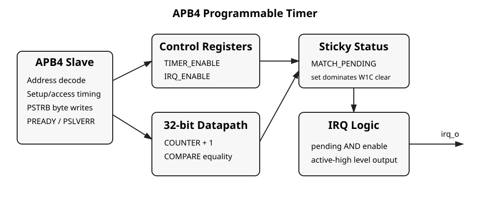
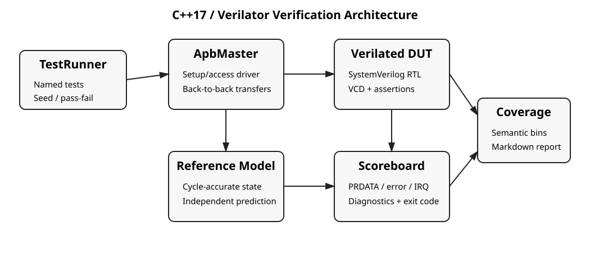
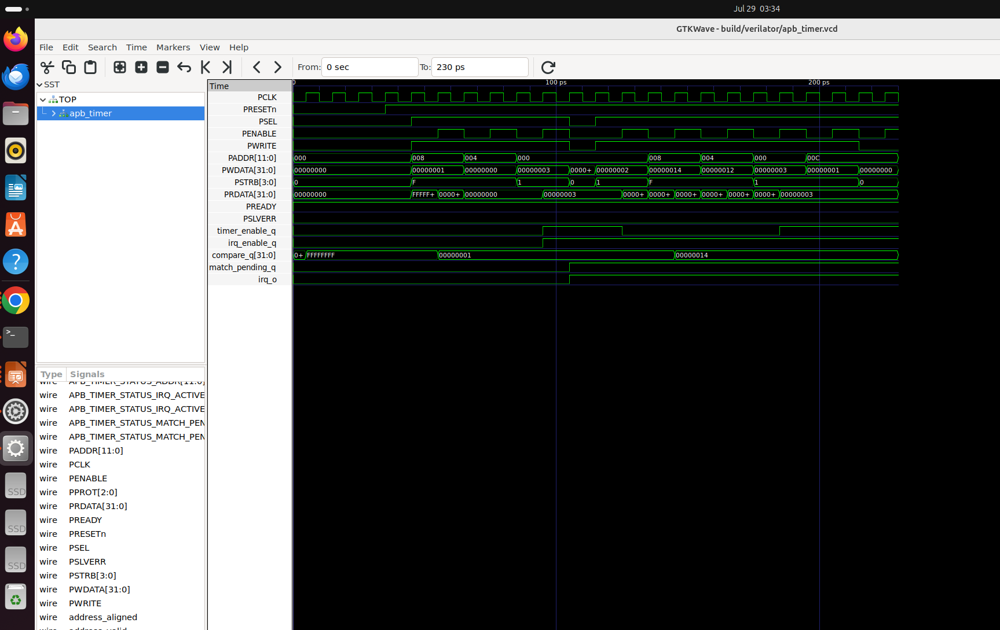

# APB4 Programmable Timer — RTL Verification to Sky130 GDSII

[](https://github.com/siyanaulakha/apb-timer-rtl-to-gds/actions/workflows/rtl-verification.yml)
[](LICENSE)

A synthesizable 32-bit APB4 timer peripheral developed through RTL design, deterministic C++17/Verilator verification, generic Yosys synthesis, and a completed Sky130 OpenLane 2 physical-design flow.

## Verified status

| Stage | Result |
|---|---:|
| Generated-register consistency | PASS |
| Icarus smoke test | 32/32 checks |
| Verilator regression | 30/30 tests |
| Scoreboard | 4,099 checks, 0 failures |
| Randomized traffic | 500 operations, seed 107 |
| Generic Yosys synthesis | 492 cells, 0 structural problems |
| Sky130 timing | 100 MHz; +0.174 ns setup, +0.113 ns hold |
| Setup / hold / slew / fanout violations | 0 / 0 / 0 / 0 |
| Route / Magic / KLayout DRC errors | 0 / 0 / 0 |
| LVS / antenna violations | 0 / 0 |
| Standard cells / area / utilization | 710 / 5,526.55 µm² / 43.90% |

Detailed evidence is in [`results/results-summary.md`](results/results-summary.md) and [`results/final-openlane/`](results/final-openlane/).

## Architecture



The block provides:

- APB4-compatible `PSEL`, `PENABLE`, `PWRITE`, `PADDR`, `PWDATA`, `PSTRB`, `PPROT`, `PRDATA`, `PREADY`, and `PSLVERR` behavior;
- a writable 32-bit free-running counter;
- a programmable compare register;
- sticky compare-match status with write-one-to-clear semantics;
- a maskable level-sensitive interrupt;
- natural 32-bit rollover;
- deterministic invalid and misaligned access errors;
- constant zero-wait-state operation (`PREADY=1`).

## Register map

| Offset | Register | Access | Purpose |
|---:|---|---|---|
| `0x000` | `CONTROL` | R/W | Timer enable and interrupt enable |
| `0x004` | `COUNTER` | R/W | Current counter value |
| `0x008` | `COMPARE` | R/W | Compare threshold |
| `0x00C` | `STATUS` | R/W1C + R/O | Match pending and live IRQ state |

[`spec/register_map.json`](spec/register_map.json) is the source of truth and generates matching SystemVerilog, C++, and Markdown definitions.

## Verification environment



The primary verification environment includes:

- `SimulationContext`: DUT, clock/reset, time, and optional VCD trace;
- `ApbMaster`: legal APB setup/access transactions and back-to-back transfers;
- `TimerReferenceModel`: independent cycle-accurate behavioral prediction;
- `Scoreboard`: bus-response and interrupt comparison with non-zero failure exit;
- `FunctionalCoverage`: semantic event and register/strobe bins;
- `TestRunner`: isolated named tests with deterministic seeds;
- bound clocked assertions for APB/interface invariants.

The suite contains 29 directed tests and one deterministic randomized test. See [`docs/verification-plan.md`](docs/verification-plan.md).



## Reproduce the RTL evidence

On Ubuntu with Icarus, Verilator, Yosys, Make, Python, and a C++17 compiler available:

```bash
make check-generated
make lint
make smoke
make evidence
make synth
make results
```

`make evidence` is the canonical 30-test, 500-operation, seed-107 regression. Reduced CI jobs and focused tests write under `build/` and cannot overwrite the committed full-regression evidence.

Run a focused traced test:

```bash
make verify TEST=T18_clear_match_collision_set_dominant TRACE=1
```

## Sky130 implementation

The final flow used:

- PDK target: `sky130A`;
- standard-cell library: `sky130_fd_sc_hd`;
- signoff period: 10.0 ns (100 MHz);
- PnR period: 9.8 ns;
- absolute die: `130 × 130 µm`;
- OpenLane 2 Classic flow with Dockerized tools.

After activating the tested OpenLane 2 environment:

```bash
RUN_TAG="apb_timer_sky130_$(date +%Y%m%d_%H%M%S)" make openlane
```

The exact final configuration and SDCs are frozen in [`results/final-openlane/`](results/final-openlane/). Large GDS/DEF/LEF/SDF/SPEF/Liberty views are kept out of Git and can be packaged for a release with:

```bash
./scripts/package_final_openlane.sh
```

## Frozen behavioral rules

- A transfer completes during `PSEL && PENABLE`; the slave inserts no wait states.
- Invalid or misaligned accesses assert `PSLVERR`, return zero on reads, and do not modify state.
- Effective CONTROL and COUNTER writes suppress automatic increment on their completion edge.
- COMPARE and STATUS writes do not suppress counting.
- A compare event occurs when automatic increment enters the programmed compare value.
- A COMPARE write applies after its completion edge; that edge compares against the old value.
- Match status is sticky and write-one-to-clear.
- A simultaneous hardware match and software clear is set-dominant.
- `irq_o = MATCH_PENDING && IRQ_ENABLE`.

See [`docs/specification.md`](docs/specification.md) and [`docs/requirements-traceability.md`](docs/requirements-traceability.md).

## Evidence qualifications

- The 0.723 mW power figure is an OpenLane estimate, not workload-characterized silicon power.
- Package-aware IR-drop accuracy is not claimed because `VSRC_LOC_FILES` was not supplied.
- OpenLane recorded 453 frontend lint warnings and zero lint errors; the warning scope is documented rather than hidden.
- The project is not UVM, commercial signoff, silicon validation, or a tapeout claim.

## Repository layout

```text
rtl/                 synthesizable timer RTL
verification/rtl/    self-checking Icarus smoke test
verification/cpp/    C++17 Verilator environment
assertions/          bound protocol/interface assertions
spec/                generated-register source of truth
synthesis/           generic Yosys flow
openlane/            active Sky130 physical-design configuration
scripts/             reproducible flows and evidence packaging
docs/                specification, plans, diagrams, and design notes
results/              canonical verification, synthesis, and signoff evidence
```

## Resume-ready description

> Designed and verified a 32-bit APB4 timer in SystemVerilog using a reusable C++17/Verilator environment, passing 30 tests, 4,099 scoreboard checks, and 500 deterministic randomized operations; implemented the block in Sky130 at 100 MHz with 710 standard cells, 5,526.55 µm² cell area, 43.9% utilization, and zero timing, DRC, LVS, antenna, slew, or fanout violations.

## License

Apache-2.0.
